# AI Avatar Technical Design Document

## Project Overview

This document outlines the technical design for an AI Avatar application that leverages Microsoft's Azure Text-to-Speech Avatar service to create an interactive conversational experience. The application provides a complete voice-to-video pipeline that processes user voice input, generates intelligent responses using Azure OpenAI, and presents the response through a photorealistic AI avatar.

## Key Learning from Azure Official Samples

Based on analysis of Azure's official samples (https://github.com/Azure-Samples/cognitive-services-speech-sdk/tree/master/samples/js/browser/avatar), the implementation approach differs significantly from initial assumptions:

### Real-Time Session-Based Architecture
- **WebRTC Real-Time Streaming**: Avatar API uses WebRTC peer connections for real-time video streaming rather than generating downloadable video files
- **Session Management**: Uses "Start Session" → "Speak" → "Stop Session" pattern, not direct synthesis calls
- **ICE Token Authentication**: Requires ICE server token from Azure for WebRTC connection setup
- **Frontend-Driven**: Primary logic resides in JavaScript frontend with minimal backend avatar session management

### Correct API Implementation Pattern
1. **Frontend**: JavaScript creates WebRTC peer connection and manages avatar session
2. **Backend**: Provides ICE tokens and handles avatar session configuration via REST endpoints
3. **Real-Time Communication**: WebRTC streams video directly to browser, no file storage needed
4. **Session Control**: Frontend controls start/stop of avatar sessions and speech synthesis

### Updated Architecture Components
- **JavaScript Frontend**: Manages WebRTC connections, avatar sessions, and real-time video display with Azure-validated character/style combinations
- **Python Backend**: Provides REST API for ICE tokens, session management, and OpenAI integration with o3-mini support using API version 2024-12-01-preview
- **Azure Avatar Service**: Real-time WebRTC-based avatar synthesis with validated character/style matrix
- **Azure Container Apps**: Serverless deployment with auto-scaling and managed identity authentication
- **Azure Developer CLI**: Infrastructure provisioning and deployment automation

## Architecture Overview

### High-Level Flow (Updated Based on Azure Samples)
```
┌─ User Voice Input ─┐                    ┌─ WebRTC Avatar Session ─┐
│                    │                    │                          │
│  ┌─ User Text ─┐   │                    │  ┌─ Real-Time Video ─┐   │
│  │   Input    │   │ → Input Processing → Azure OpenAI LLM → │     Streaming     │ → Video Display
│  └────────────┘   │     (Speech-to-Text      (GPT-4o/O3-mini)    │   (WebRTC)      │   (Browser)
│                    │      for voice only)                        └─────────────────┘
└────────────────────┘                                                      ↑
                                                                Azure Avatar Service
                                                                (Real-time TTS + Video)
```

### Detailed Process Flow (Updated)
1. **Avatar Session Setup**: 
   - Frontend requests ICE token from backend
   - JavaScript establishes WebRTC peer connection with Azure Avatar Service
   - Avatar session starts with configured character, style, and background
2. **User Input Capture**: 
   - **Voice Input**: User speaks into the web interface (WebRTC audio capture)
   - **Text Input**: User types directly into the chat interface
3. **Input Processing**: 
   - **Voice**: Azure Speech Services converts audio to text
   - **Text**: Direct text input bypasses speech-to-text conversion
4. **LLM Processing**: Text is sent to Azure OpenAI (GPT-4o or O3-mini) for intelligent response generation
5. **Real-Time Avatar Speech**: Response text is sent to active avatar session for immediate speech synthesis and video generation
6. **Live Video Streaming**: Avatar video streams in real-time via WebRTC to browser video element

## System Architecture

### Architecture Diagram (Updated for Real-Time WebRTC)

```mermaid
graph TB
    subgraph "Frontend (JavaScript)"
        UI[Web Browser]
        VI[Voice Input]
        TI[Text Input]
        MS[Model Selector]
        WRT[WebRTC Manager]
        AVS[Avatar Session]
        VD[Video Display]
        CH[Chat History]
    end
    
    subgraph "Backend (Python Flask)"
        Auth[Authentication Module]
        API[Flask API Routes]
        ICE[ICE Token Provider]
        Session[Session Management]
    end
    
    subgraph "Business Logic Layer"
        Speech[Speech Processing]
        OpenAI[OpenAI Integration]
        Avatar[Avatar Session Manager]
        Cache[Response Cache]
    end
    
    subgraph "Azure Services"
        STT[Speech-to-Text API]
        AvatarAPI[Avatar WebRTC Service]
        ICETok[Avatar ICE Token Service]
        GPT4[GPT-4o Deployment]
        O3[O3-mini Deployment]
        KV[Key Vault]
        Storage[Blob Storage]
        Insights[Application Insights]
    end
    
    subgraph "Infrastructure"
        AppService[Azure App Service]
        CDN[Azure CDN]
        Monitor[Azure Monitor]
    end
    
    %% Frontend Connections
    UI --> VI
    UI --> TI
    UI --> MS
    UI --> WRT
    UI --> VD
    UI --> CH
    WRT --> AVS
    
    %% Frontend to Backend
    VI --> Auth
    TI --> Auth
    MS --> Auth
    WRT --> ICE
    Auth --> API
    
    %% Backend Processing
    API --> Speech
    API --> OpenAI
    API --> Avatar
    API --> Session
    ICE --> ICETok
    
    %% Real-Time WebRTC Connection
    AVS -.->|WebRTC Stream| AvatarAPI
    VD -.->|Real-time Video| AvatarAPI
    
    %% Business Logic to Azure Services
    Speech --> STT
    OpenAI --> GPT4
    OpenAI --> O3
    Avatar --> AvatarAPI
    Cache --> Storage
    
    %% Security and Configuration
    Speech --> KV
    OpenAI --> KV
    Avatar --> KV
    
    %% Monitoring
    API --> Insights
    Speech --> Insights
    OpenAI --> Insights
    Avatar --> Insights
    
    %% Infrastructure Hosting
    Auth -.-> AppService
    API -.-> AppService
    Speech -.-> AppService
    OpenAI -.-> AppService
    Avatar -.-> AppService
    
    %% Content Delivery
    AV --> CDN
    Storage --> CDN
    
    %% Response Flow (dotted lines)
    TTS -.-> Avatar
    Avatar -.-> API
    API -.-> UI
    Storage -.-> UI
    
    %% Styling
    classDef userLayer fill:#e1f5fe
    classDef appLayer fill:#f3e5f5
    classDef businessLayer fill:#e8f5e8
    classDef azureLayer fill:#fff3e0
    classDef infraLayer fill:#fce4ec
    
    class UI,VI,TI,MS,AV,CH userLayer
    class Auth,API,Session appLayer
    class Speech,OpenAI,Avatar,Cache businessLayer
    class STT,TTS,GPT4,O3,KV,Storage,Insights azureLayer
    class AppService,CDN,Monitor infraLayer
```



### Technology Stack
- **Backend Framework**: Python Flask
- **Frontend**: HTML5, CSS3, JavaScript (with WebRTC for real-time audio/video)
- **Cloud Platform**: Microsoft Azure
- **Infrastructure as Code**: Azure Developer CLI (AZD) with Bicep templates
- **Containerization**: Docker for application packaging and deployment
- **Authentication**: Simple form-based authentication (Login: UTASAvatar, Password: UTASRocks!)

### Azure Services Integration

#### Core Services
1. **Azure Speech Services**
   - Speech-to-Text API for voice input processing
   - Text-to-Speech Avatar API for video generation
   - Supported regions: Southeast Asia, North Europe, West Europe, Sweden Central, South Central US, West US 2

2. **Azure OpenAI Service**
   - GPT-4o deployment for advanced conversational AI
   - O3-mini deployment for efficient processing
   - Text-embedding-3-small for semantic understanding

3. **Azure Container Apps**
   - Hosts the containerized Flask web application
   - Provides serverless auto-scaling and high availability
   - Supports blue-green deployments and traffic splitting
   - Integrated with Application Insights for monitoring

4. **Azure Storage Account**
   - Stores generated avatar videos
   - Caches conversation history
   - Blob storage for temporary audio files

#### Supporting Services
1. **Azure Key Vault**
   - Secure storage of API keys and connection strings
   - SSL certificate management

2. **Azure Application Insights**
   - Application performance monitoring
   - User interaction analytics
   - Error tracking and debugging

3. **Azure CDN (Optional)**
   - Global distribution of static assets
   - Improved performance for video delivery

## Technical Implementation Details

### Azure Text-to-Speech Avatar Service

#### Service Capabilities
- **Video Output**: 1920x1080 resolution at 25 FPS
- **Synthesis Modes**: 
  - Batch synthesis (asynchronous) for pre-recorded content
  - Real-time synthesis for interactive conversations
- **Codec Support**: H.264, HEVC, VP9, AV1
- **Voice Integration**: Supports 90+ languages and 100+ locales
- **Gesture Support**: SSML-based gesture insertion using bookmark elements
- **Customizable Options**:
  - **Character Selection**: Azure-validated avatar characters (lisa, harry, jeff, lori, meg, max)
  - **Style Variations**: Real-time compatible styles with character-specific limitations:
    - Lisa: casual-sitting only (for real-time synthesis)
    - Harry: business, casual, youthful
    - Jeff: business, formal
    - Lori: casual, formal
    - Meg: formal, casual, business
    - Max: business, casual, formal
  - **Background Options**: Solid colors, custom images, or transparent backgrounds
  - **Video Quality**: Adjustable bitrate and codec selection
  - **Voice Selection**: Choose from 400+ neural voices across languages

#### Implementation Approach
```python
# Real-time Avatar Synthesis with Enhanced Configuration
from azure.cognitiveservices.speech import SpeechSynthesizer
from azure.cognitiveservices.speech.avatar import AvatarSynthesizer

# Enhanced Avatar Configuration (Azure-Validated)
avatar_config = {
    "character": "lisa",  # Validated options: lisa, harry, jeff, lori, meg, max
    "style": "casual-sitting",  # Lisa-compatible style (real-time synthesis)
    "background": {
        "type": "color",  # Options: color, image, transparent
        "value": "#FFFFFFFF"  # Color hex or image URL
    },
    "voice": "en-US-JennyNeural",  # 400+ voice options
    "video_format": {
        "codec": "h264",  # Options: h264, hevc, vp9, av1
        "bitrate": 2000000,  # Adjustable bitrate
        "quality": "high"  # Options: low, medium, high
    }
}

# Character/Style Compatibility Matrix (Real-time Synthesis)
character_style_matrix = {
    'lisa': ['casual-sitting'],  # Only casual-sitting for real-time
    'harry': ['business', 'casual', 'youthful'],
    'jeff': ['business', 'formal'],
    'lori': ['casual', 'formal'],  # graceful not in real-time
    'meg': ['formal', 'casual', 'business'],
    'max': ['business', 'casual', 'formal']
}

# Synthesis with gesture support
def create_avatar_with_gesture(text, gesture_type=None):
    if gesture_type:
        ssml_text = f'''
        <speak version="1.0" xmlns="http://www.w3.org/2001/10/synthesis" xml:lang="en-US">
            <voice name="{avatar_config['voice']}">
                {text} <bookmark mark="gesture.{gesture_type}"/>
            </voice>
        </speak>
        '''
    else:
        ssml_text = text
    
    synthesizer = AvatarSynthesizer(speech_config, avatar_config)
    result = synthesizer.speak_ssml_async(ssml_text).get()
    return result
```

### Application Components

#### 1. Authentication Module (`src/auth/`)
```python
# Simple form-based authentication
VALID_CREDENTIALS = {
    "UTASAvatar": "UTASRocks!"
}

def authenticate_user(username, password):
    return VALID_CREDENTIALS.get(username) == password
```

#### 2. Input Processing Module (`src/input/`)
```python
# Unified input processing for voice and text
class InputProcessor:
    def __init__(self, speech_service):
        self.speech_service = speech_service
    
    async def process_voice_input(self, audio_data):
        """Convert voice to text using Azure Speech Services"""
        speech_recognizer = SpeechRecognizer(self.speech_service.config)
        result = await speech_recognizer.recognize_once_async(audio_data)
        return {
            'text': result.text,
            'confidence': result.confidence,
            'input_type': 'voice'
        }
    
    def process_text_input(self, text):
        """Process direct text input"""
        return {
            'text': text.strip(),
            'confidence': 1.0,
            'input_type': 'text'
        }
    
    async def process_input(self, input_data, input_type):
        """Unified input processing"""
        if input_type == 'voice':
            return await self.process_voice_input(input_data)
        elif input_type == 'text':
            return self.process_text_input(input_data)
        else:
            raise ValueError(f"Unsupported input type: {input_type}")
```

#### 3. Speech Processing Module (`src/speech/`)
```python
# Speech-to-Text
def transcribe_audio(audio_data):
    speech_recognizer = SpeechRecognizer(speech_config)
    result = speech_recognizer.recognize_once_async().get()
    return result.text

# Text-to-Speech Avatar
def generate_avatar_video(text, model_choice):
    avatar_synthesizer = AvatarSynthesizer(speech_config, avatar_config)
    video_result = avatar_synthesizer.speak_text_async(text).get()
    return video_result.video_data
```

#### 4. OpenAI Integration Module (`src/openai/`)
```python
# Azure OpenAI integration with model selection and latest API version
class OpenAIService:
    def __init__(self):
        self.client = AzureOpenAI(
            azure_endpoint=os.getenv("AZURE_OPENAI_ENDPOINT"),
            api_key=os.getenv("AZURE_OPENAI_KEY"),
            api_version="2024-12-01-preview"  # Required for o3-mini model support
        )
        self.models = {
            'gpt4o': os.getenv("AZURE_OPENAI_GPT4O_DEPLOYMENT"),
            'o3-mini': os.getenv("AZURE_OPENAI_O3_MINI_DEPLOYMENT")
        }
    
    def get_ai_response(self, user_input, model_choice, conversation_history=None):
        """Generate AI response with selected model"""
        deployment = self.models.get(model_choice, self.models['gpt4o'])
        
        messages = []
        if conversation_history:
            messages.extend(conversation_history)
        messages.append({"role": "user", "content": user_input})
        
        response = self.client.chat.completions.create(
            model=deployment,
            messages=messages,
            temperature=0.7,
            max_tokens=1000
        )
        
        return {
            'content': response.choices[0].message.content,
            'model_used': model_choice,
            'tokens_used': response.usage.total_tokens if response.usage else 0
        }
    
    def get_available_models(self):
        """Return list of available models"""
        return list(self.models.keys())
```

#### 5. Avatar Management Module (`src/avatar/`)
```python
# Enhanced Avatar configuration and management (Azure-Validated)
class AvatarManager:
    def __init__(self):
        # Azure-validated character options for real-time synthesis
        self.available_characters = [
            {'id': 'lisa', 'name': 'Lisa', 'description': 'Professional female avatar'},
            {'id': 'harry', 'name': 'Harry', 'description': 'Professional male avatar'},
            {'id': 'jeff', 'name': 'Jeff', 'description': 'Business male avatar'},
            {'id': 'lori', 'name': 'Lori', 'description': 'Friendly female avatar'},
            {'id': 'meg', 'name': 'Meg', 'description': 'Professional female avatar'},
            {'id': 'max', 'name': 'Max', 'description': 'Business male avatar'}
        ]
        
        # Character/Style compatibility matrix for real-time synthesis
        self.character_style_matrix = {
            'lisa': ['casual-sitting'],  # Only casual-sitting for real-time
            'harry': ['business', 'casual', 'youthful'],
            'jeff': ['business', 'formal'],
            'lori': ['casual', 'formal'],
            'meg': ['formal', 'casual', 'business'],
            'max': ['business', 'casual', 'formal']
        }
        ]
        
        self.available_styles = [
            {'id': 'graceful-sitting', 'name': 'Graceful Sitting', 'description': 'Elegant seated pose'},
            {'id': 'standing', 'name': 'Standing', 'description': 'Professional standing pose'},
            {'id': 'casual', 'name': 'Casual', 'description': 'Relaxed casual pose'},
            {'id': 'professional', 'name': 'Professional', 'description': 'Business professional pose'}
        ]
        
        self.available_voices = [
            {'id': 'en-US-JennyNeural', 'name': 'Jenny (US)', 'gender': 'Female', 'language': 'English (US)'},
            {'id': 'en-US-AriaNeural', 'name': 'Aria (US)', 'gender': 'Female', 'language': 'English (US)'},
            {'id': 'en-US-DavisNeural', 'name': 'Davis (US)', 'gender': 'Male', 'language': 'English (US)'},
            {'id': 'en-US-JasonNeural', 'name': 'Jason (US)', 'gender': 'Male', 'language': 'English (US)'},
            {'id': 'en-GB-SoniaNeural', 'name': 'Sonia (UK)', 'gender': 'Female', 'language': 'English (UK)'},
            {'id': 'en-AU-NatashaNeural', 'name': 'Natasha (AU)', 'gender': 'Female', 'language': 'English (AU)'}
        ]
        
        self.available_gestures = [
            {'id': 'wave-left-1', 'name': 'Wave Left', 'description': 'Wave with left hand'},
            {'id': 'wave-right-1', 'name': 'Wave Right', 'description': 'Wave with right hand'},
            {'id': 'nod-1', 'name': 'Nod', 'description': 'Nod head in agreement'},
            {'id': 'shake-1', 'name': 'Shake Head', 'description': 'Shake head in disagreement'},
            {'id': 'thumbs-up-1', 'name': 'Thumbs Up', 'description': 'Show thumbs up'},
            {'id': 'point-1', 'name': 'Point', 'description': 'Point forward'}
        ]
        
        self.background_options = [
            {'id': 'solid-white', 'name': 'Solid White', 'type': 'color', 'value': '#FFFFFF'},
            {'id': 'solid-blue', 'name': 'Solid Blue', 'type': 'color', 'value': '#4A90E2'},
            {'id': 'solid-gray', 'name': 'Solid Gray', 'type': 'color', 'value': '#F5F5F5'},
            {'id': 'transparent', 'name': 'Transparent', 'type': 'transparent', 'value': None},
            {'id': 'office', 'name': 'Office Background', 'type': 'image', 'value': '/static/backgrounds/office.jpg'},
            {'id': 'living-room', 'name': 'Living Room', 'type': 'image', 'value': '/static/backgrounds/living-room.jpg'}
        ]
        
        # Default configuration
        self.default_config = {
            'character': 'lisa',
            'style': 'graceful-sitting',
            'voice': 'en-US-JennyNeural',
            'background': 'solid-white',
            'gesture': None,
            'video_quality': 'high'
        }
    
    def get_avatar_options(self):
        """Return all available avatar customization options"""
        return {
            'characters': self.available_characters,
            'styles': self.available_styles,
            'voices': self.available_voices,
            'gestures': self.available_gestures,
            'backgrounds': self.background_options
        }
    
    def build_avatar_config(self, user_preferences):
        """Build avatar configuration from user preferences"""
        config = self.default_config.copy()
        config.update(user_preferences)
        
        # Get background configuration
        background_option = next(
            (bg for bg in self.background_options if bg['id'] == config['background']), 
            self.background_options[0]
        )
        
        avatar_config = {
            "character": config['character'],
            "style": config['style'],
            "background": {
                "type": background_option['type'],
                "value": background_option['value']
            },
            "voice": config['voice'],
            "video_format": {
                "codec": "h264",
                "bitrate": 3000000 if config['video_quality'] == 'high' else 2000000,
                "quality": config['video_quality']
            }
        }
        
        return avatar_config
    
    async def create_avatar_video(self, text, user_preferences, gesture=None):
        """Create avatar video with user customizations"""
        avatar_config = self.build_avatar_config(user_preferences)
        
        # Add gesture if specified
        if gesture:
            ssml_text = self.add_gesture(text, gesture)
        else:
            ssml_text = f'''
            <speak version="1.0" xmlns="http://www.w3.org/2001/10/synthesis" xml:lang="en-US">
                <voice name="{avatar_config['voice']}">{text}</voice>
            </speak>
            '''
        
        synthesizer = AvatarSynthesizer(speech_config, avatar_config)
        result = await synthesizer.speak_ssml_async(ssml_text)
        
        # Store video and return reference
        video_id = self.store_video(result.video_data)
        
        return {
            'video_id': video_id,
            'duration': result.duration,
            'config_used': avatar_config
        }
    
    def add_gesture(self, text, gesture_type):
        """Add gesture bookmarks to SSML"""
        return f'''
        <speak version="1.0" xmlns="http://www.w3.org/2001/10/synthesis" xml:lang="en-US">
            <voice name="{self.default_config['voice']}">
                {text} <bookmark mark="gesture.{gesture_type}"/>
            </voice>
        </speak>
        '''
    
    def store_video(self, video_data):
        """Store video in Azure Blob Storage and return ID"""
        # Implementation for storing video
        import uuid
        video_id = str(uuid.uuid4())
        # Store video_data to blob storage with video_id
        return video_id
    
    def get_video_path(self, video_id):
        """Get path to stored video"""
        # Implementation to retrieve video path from storage
        return f"/tmp/avatars/{video_id}.mp4"
```

### Frontend Implementation

#### Web Interface Features
1. **Dual Input Interface**
   - **Voice Recording**: WebRTC-based audio capture with real-time visualization
   - **Text Input**: Traditional chat input field with typing indicators
   - **Input Mode Toggle**: Switch between voice and text input modes
   - **Start/stop recording controls** for voice input

2. **Model Selection Interface**
   - **Model Dropdown**: Choose between GPT-4o and O3-mini
   - **Model-specific settings**: Temperature, max tokens, etc.
   - **Performance indicators**: Response time and token usage display

3. **Enhanced Chat Interface**
   - **Unified conversation view**: Shows both text and voice inputs/outputs
   - **Message bubbles**: Different styling for user vs. avatar messages
   - **Input type indicators**: Visual cues showing whether input was voice or text
   - **Typing indicators**: Real-time feedback during processing

4. **Avatar Display & Customization**
   - **HTML5 video player** for avatar output
   - **Avatar Settings Panel**: Character, style, voice, and background selection
   - **Responsive design** for various screen sizes
   - **Full-screen mode** support
   - **Video controls**: Play, pause, volume control
   - **Gesture Controls**: Optional gesture selection for responses

5. **Conversation Management**
   - **Chat history**: Persistent conversation storage
   - **Export functionality**: Download conversation as text or audio
   - **Clear conversation**: Reset chat history
   - **Message search**: Find specific conversations

#### JavaScript Implementation
```javascript
// Enhanced Input Manager
class InputManager {
    constructor() {
        this.audioRecorder = new AudioRecorder();
        this.inputMode = 'text'; // 'text' or 'voice'
        this.isRecording = false;
    }
    
    setInputMode(mode) {
        this.inputMode = mode;
        this.updateUI();
    }
    
    async handleInput() {
        if (this.inputMode === 'voice') {
            return await this.handleVoiceInput();
        } else {
            return this.handleTextInput();
        }
    }
    
    async handleVoiceInput() {
        if (!this.isRecording) {
            await this.audioRecorder.startRecording();
            this.isRecording = true;
            this.updateRecordingUI(true);
        } else {
            const audioBlob = await this.audioRecorder.stopRecording();
            this.isRecording = false;
            this.updateRecordingUI(false);
            return { type: 'voice', data: audioBlob };
        }
    }
    
    handleTextInput() {
        const textInput = document.getElementById('text-input');
        const text = textInput.value.trim();
        if (text) {
            textInput.value = '';
            return { type: 'text', data: text };
        }
        return null;
    }
    
    updateUI() {
        const voiceControls = document.getElementById('voice-controls');
        const textControls = document.getElementById('text-controls');
        
        if (this.inputMode === 'voice') {
            voiceControls.style.display = 'block';
            textControls.style.display = 'none';
        } else {
            voiceControls.style.display = 'none';
            textControls.style.display = 'block';
        }
    }
    
    updateRecordingUI(isRecording) {
        const recordButton = document.getElementById('record-button');
        recordButton.textContent = isRecording ? 'Stop Recording' : 'Start Recording';
        recordButton.classList.toggle('recording', isRecording);
    }
}

// Enhanced Chat Interface
class ChatInterface {
    constructor() {
        this.inputManager = new InputManager();
        this.avatarPlayer = new AvatarPlayer(document.getElementById('avatar-video'));
        this.conversationHistory = [];
        this.selectedModel = 'gpt4o';
        this.avatarSettings = {
            character: 'lisa',
            style: 'graceful-sitting',
            voice: 'en-US-JennyNeural',
            background: 'solid-white',
            gesture: null,
            video_quality: 'high'
        };
        
        this.initializeAvatarOptions();
    }
    
    async initializeAvatarOptions() {
        try {
            const response = await fetch('/api/avatar/options');
            const options = await response.json();
            this.populateAvatarControls(options);
        } catch (error) {
            console.error('Failed to load avatar options:', error);
        }
    }
    
    populateAvatarControls(options) {
        // Populate character selector
        const characterSelect = document.getElementById('avatar-character');
        characterSelect.innerHTML = '';
        options.characters.forEach(char => {
            const option = document.createElement('option');
            option.value = char.id;
            option.textContent = char.name;
            option.title = char.description;
            characterSelect.appendChild(option);
        });
        
        // Populate style selector
        const styleSelect = document.getElementById('avatar-style');
        styleSelect.innerHTML = '';
        options.styles.forEach(style => {
            const option = document.createElement('option');
            option.value = style.id;
            option.textContent = style.name;
            option.title = style.description;
            styleSelect.appendChild(option);
        });
        
        // Populate voice selector
        const voiceSelect = document.getElementById('avatar-voice');
        voiceSelect.innerHTML = '';
        options.voices.forEach(voice => {
            const option = document.createElement('option');
            option.value = voice.id;
            option.textContent = `${voice.name} (${voice.gender})`;
            voiceSelect.appendChild(option);
        });
        
        // Populate background selector
        const backgroundSelect = document.getElementById('avatar-background');
        backgroundSelect.innerHTML = '';
        options.backgrounds.forEach(bg => {
            const option = document.createElement('option');
            option.value = bg.id;
            option.textContent = bg.name;
            backgroundSelect.appendChild(option);
        });
        
        // Populate gesture selector
        const gestureSelect = document.getElementById('avatar-gesture');
        gestureSelect.innerHTML = '<option value="">No Gesture</option>';
        options.gestures.forEach(gesture => {
            const option = document.createElement('option');
            option.value = gesture.id;
            option.textContent = gesture.name;
            option.title = gesture.description;
            gestureSelect.appendChild(option);
        });
        
        // Set up event listeners for avatar settings
        this.setupAvatarSettingsListeners();
    }
    
    setupAvatarSettingsListeners() {
        document.getElementById('avatar-character').addEventListener('change', (e) => {
            this.avatarSettings.character = e.target.value;
            this.updateAvatarPreview();
        });
        
        document.getElementById('avatar-style').addEventListener('change', (e) => {
            this.avatarSettings.style = e.target.value;
            this.updateAvatarPreview();
        });
        
        document.getElementById('avatar-voice').addEventListener('change', (e) => {
            this.avatarSettings.voice = e.target.value;
        });
        
        document.getElementById('avatar-background').addEventListener('change', (e) => {
            this.avatarSettings.background = e.target.value;
            this.updateAvatarPreview();
        });
        
        document.getElementById('avatar-gesture').addEventListener('change', (e) => {
            this.avatarSettings.gesture = e.target.value || null;
        });
        
        document.getElementById('video-quality').addEventListener('change', (e) => {
            this.avatarSettings.video_quality = e.target.value;
        });
    }
    
    async updateAvatarPreview() {
        // Show a preview of the selected avatar configuration
        const previewContainer = document.getElementById('avatar-preview');
        if (previewContainer) {
            try {
                const response = await fetch('/api/avatar/preview', {
                    method: 'POST',
                    headers: { 'Content-Type': 'application/json' },
                    body: JSON.stringify(this.avatarSettings)
                });
                
                if (response.ok) {
                    const result = await response.json();
                    previewContainer.innerHTML = `
                        <div class="avatar-preview-info">
                            <h4>Avatar Preview</h4>
                            <p><strong>Character:</strong> ${this.avatarSettings.character}</p>
                            <p><strong>Style:</strong> ${this.avatarSettings.style}</p>
                            <p><strong>Voice:</strong> ${this.avatarSettings.voice}</p>
                            <p><strong>Background:</strong> ${this.avatarSettings.background}</p>
                        </div>
                    `;
                }
            } catch (error) {
                console.error('Failed to update avatar preview:', error);
            }
        }
    }
    
    async sendMessage() {
        const input = await this.inputManager.handleInput();
        if (!input) return;
        
        // Add user message to chat
        this.addMessageToChat('user', input.data, input.type);
        
        // Show loading indicator
        this.showLoadingIndicator();
        
        try {
            // Send to backend
            const response = await this.sendToBackend(input, this.selectedModel);
            
            // Add AI response to chat
            this.addMessageToChat('assistant', response.text, 'text');
            
            // Play avatar video
            if (response.video) {
                await this.avatarPlayer.playAvatarResponse(response.video);
            }
            
            // Update conversation history
            this.conversationHistory.push(
                { role: 'user', content: input.data, input_type: input.type },
                { role: 'assistant', content: response.text, model_used: response.model }
            );
            
        } catch (error) {
            this.showError('Failed to get response: ' + error.message);
        } finally {
            this.hideLoadingIndicator();
        }
    }
    
    addMessageToChat(sender, content, type) {
        const chatContainer = document.getElementById('chat-container');
        const messageDiv = document.createElement('div');
        messageDiv.className = `message ${sender}-message`;
        
        const typeIcon = type === 'voice' ? '🎤' : '💬';
        const timestamp = new Date().toLocaleTimeString();
        
        messageDiv.innerHTML = `
            <div class="message-header">
                <span class="sender">${sender === 'user' ? 'You' : 'Avatar'}</span>
                <span class="type-icon">${typeIcon}</span>
                <span class="timestamp">${timestamp}</span>
            </div>
            <div class="message-content">${content}</div>
        `;
        
        chatContainer.appendChild(messageDiv);
        chatContainer.scrollTop = chatContainer.scrollHeight;
    }
    
    async sendToBackend(input, model) {
        const formData = new FormData();
        
        if (input.type === 'voice') {
            formData.append('audio', input.data);
            formData.append('input_type', 'voice');
        } else {
            formData.append('text', input.data);
            formData.append('input_type', 'text');
        }
        
        formData.append('model', model);
        formData.append('conversation_history', JSON.stringify(this.conversationHistory));
        formData.append('avatar_settings', JSON.stringify(this.avatarSettings));
        
        const response = await fetch('/api/chat', {
            method: 'POST',
            body: formData
        });
        
        if (!response.ok) {
            throw new Error(`HTTP ${response.status}: ${response.statusText}`);
        }
        
        const result = await response.json();
        return result;
    }
    
    setModel(model) {
        this.selectedModel = model;
        document.getElementById('model-indicator').textContent = model.toUpperCase();
    }
    
    showLoadingIndicator() {
        document.getElementById('loading-indicator').style.display = 'block';
    }
    
    hideLoadingIndicator() {
        document.getElementById('loading-indicator').style.display = 'none';
    }
    
    showError(message) {
        const errorDiv = document.getElementById('error-message');
        errorDiv.textContent = message;
        errorDiv.style.display = 'block';
        setTimeout(() => {
            errorDiv.style.display = 'none';
        }, 5000);
    }
}

// WebRTC Audio Capture (Enhanced)
class AudioRecorder {
    constructor() {
        this.mediaRecorder = null;
        this.audioChunks = [];
        this.stream = null;
    }
    
    async startRecording() {
        this.stream = await navigator.mediaDevices.getUserMedia({ 
            audio: {
                echoCancellation: true,
                noiseSuppression: true,
                sampleRate: 44100
            }
        });
        
        this.mediaRecorder = new MediaRecorder(this.stream, {
            mimeType: 'audio/webm;codecs=opus'
        });
        
        this.audioChunks = [];
        
        this.mediaRecorder.addEventListener('dataavailable', (event) => {
            this.audioChunks.push(event.data);
        });
        
        this.mediaRecorder.start();
        this.startVisualization();
    }
    
    stopRecording() {
        return new Promise((resolve) => {
            this.mediaRecorder.addEventListener('stop', () => {
                const audioBlob = new Blob(this.audioChunks, { type: 'audio/webm' });
                this.stopVisualization();
                this.stream.getTracks().forEach(track => track.stop());
                resolve(audioBlob);
            });
            
            this.mediaRecorder.stop();
        });
    }
    
    startVisualization() {
        // Add audio visualization using Web Audio API
        const audioContext = new AudioContext();
        const analyser = audioContext.createAnalyser();
        const source = audioContext.createMediaStreamSource(this.stream);
        source.connect(analyser);
        
        const canvas = document.getElementById('audio-visualizer');
        const ctx = canvas.getContext('2d');
        
        const visualize = () => {
            if (this.mediaRecorder && this.mediaRecorder.state === 'recording') {
                requestAnimationFrame(visualize);
                
                const bufferLength = analyser.frequencyBinCount;
                const dataArray = new Uint8Array(bufferLength);
                analyser.getByteFrequencyData(dataArray);
                
                ctx.clearRect(0, 0, canvas.width, canvas.height);
                
                const barWidth = (canvas.width / bufferLength) * 2.5;
                let barHeight;
                let x = 0;
                
                for (let i = 0; i < bufferLength; i++) {
                    barHeight = dataArray[i] / 2;
                    
                    ctx.fillStyle = `rgb(50, ${barHeight + 100}, 50)`;
                    ctx.fillRect(x, canvas.height - barHeight, barWidth, barHeight);
                    
                    x += barWidth + 1;
                }
            }
        };
        
        visualize();
    }
    
    stopVisualization() {
        const canvas = document.getElementById('audio-visualizer');
        const ctx = canvas.getContext('2d');
        ctx.clearRect(0, 0, canvas.width, canvas.height);
    }
}

// Avatar Video Player (Enhanced)
class AvatarPlayer {
    constructor(videoElement) {
        this.video = videoElement;
        this.currentVideoUrl = null;
    }
    
    async playAvatarResponse(videoBlob) {
        // Clean up previous video URL
        if (this.currentVideoUrl) {
            URL.revokeObjectURL(this.currentVideoUrl);
        }
        
        this.currentVideoUrl = URL.createObjectURL(videoBlob);
        this.video.src = this.currentVideoUrl;
        
        // Add event listeners for better UX
        this.video.addEventListener('loadstart', () => {
            this.showVideoLoading(true);
        });
        
        this.video.addEventListener('canplay', () => {
            this.showVideoLoading(false);
            this.video.play();
        });
        
        this.video.addEventListener('ended', () => {
            this.onVideoEnded();
        });
        
        return new Promise((resolve) => {
            this.video.addEventListener('ended', resolve, { once: true });
        });
    }
    
    showVideoLoading(isLoading) {
        const loadingOverlay = document.getElementById('video-loading');
        loadingOverlay.style.display = isLoading ? 'flex' : 'none';
    }
    
    onVideoEnded() {
        // Clean up and prepare for next video
        if (this.currentVideoUrl) {
            URL.revokeObjectURL(this.currentVideoUrl);
            this.currentVideoUrl = null;
        }
    }
}

// Initialize the application
document.addEventListener('DOMContentLoaded', () => {
    const chatInterface = new ChatInterface();
    
    // Set up event listeners
    document.getElementById('send-button').addEventListener('click', () => {
        chatInterface.sendMessage();
    });
    
    document.getElementById('text-input').addEventListener('keypress', (e) => {
        if (e.key === 'Enter' && !e.shiftKey) {
            e.preventDefault();
            chatInterface.sendMessage();
        }
    });
    
    document.getElementById('input-mode-toggle').addEventListener('change', (e) => {
        chatInterface.inputManager.setInputMode(e.target.value);
    });
    
    document.getElementById('model-selector').addEventListener('change', (e) => {
        chatInterface.setModel(e.target.value);
    });
    
    document.getElementById('record-button').addEventListener('click', () => {
        chatInterface.sendMessage();
    });
});
```

#### HTML Template Structure (`templates/index.html`)
```html
<!DOCTYPE html>
<html lang="en">
<head>
    <meta charset="UTF-8">
    <meta name="viewport" content="width=device-width, initial-scale=1.0">
    <title>AI Avatar Chat</title>
    <link rel="stylesheet" href="{{ url_for('static', filename='css/style.css') }}">
</head>
<body>
    <div class="container">
        <!-- Header -->
        <header class="app-header">
            <h1>AI Avatar Assistant</h1>
            <div class="header-controls">
                <select id="model-selector" class="model-selector">
                    <option value="gpt4o">GPT-4o</option>
                    <option value="o3-mini">O3-mini</option>
                </select>
                <span id="model-indicator" class="model-indicator">GPT4O</span>
                <button id="logout-button" class="logout-button">Logout</button>
            </div>
        </header>

        <!-- Main Content -->
        <main class="main-content">
            <!-- Avatar Display Section -->
            <section class="avatar-section">
                <div class="avatar-container">
                    <video id="avatar-video" class="avatar-video" controls>
                        Your browser does not support video playback.
                    </video>
                    <div id="video-loading" class="video-loading">
                        <div class="spinner"></div>
                        <p>Generating avatar response...</p>
                    </div>
                </div>
                
                <!-- Avatar Settings Panel -->
                <div class="avatar-settings-panel">
                    <h3>Avatar Settings</h3>
                    <div class="settings-grid">
                        <div class="setting-group">
                            <label for="avatar-character">Character:</label>
                            <select id="avatar-character" class="setting-select">
                                <option value="lisa">Lisa</option>
                            </select>
                        </div>
                        
                        <div class="setting-group">
                            <label for="avatar-style">Style:</label>
                            <select id="avatar-style" class="setting-select">
                                <option value="graceful-sitting">Graceful Sitting</option>
                            </select>
                        </div>
                        
                        <div class="setting-group">
                            <label for="avatar-voice">Voice:</label>
                            <select id="avatar-voice" class="setting-select">
                                <option value="en-US-JennyNeural">Jenny (US)</option>
                            </select>
                        </div>
                        
                        <div class="setting-group">
                            <label for="avatar-background">Background:</label>
                            <select id="avatar-background" class="setting-select">
                                <option value="solid-white">Solid White</option>
                            </select>
                        </div>
                        
                        <div class="setting-group">
                            <label for="avatar-gesture">Gesture:</label>
                            <select id="avatar-gesture" class="setting-select">
                                <option value="">No Gesture</option>
                            </select>
                        </div>
                        
                        <div class="setting-group">
                            <label for="video-quality">Quality:</label>
                            <select id="video-quality" class="setting-select">
                                <option value="high">High</option>
                                <option value="medium">Medium</option>
                                <option value="low">Low</option>
                            </select>
                        </div>
                    </div>
                    
                    <!-- Avatar Preview -->
                    <div id="avatar-preview" class="avatar-preview">
                        <!-- Preview content will be dynamically generated -->
                    </div>
                </div>
            </section>

            <!-- Chat Section -->
            <section class="chat-section">
                <div id="chat-container" class="chat-container">
                    <!-- Messages will be dynamically added here -->
                </div>
                
                <!-- Error Message Display -->
                <div id="error-message" class="error-message"></div>
                
                <!-- Loading Indicator -->
                <div id="loading-indicator" class="loading-indicator">
                    <div class="spinner"></div>
                    <span>Processing your request...</span>
                </div>
            </section>
        </main>

        <!-- Input Section -->
        <footer class="input-section">
            <!-- Input Mode Toggle -->
            <div class="input-mode-controls">
                <label class="toggle-switch">
                    <input type="radio" name="input-mode" value="text" id="input-mode-text" checked>
                    <span>💬 Text</span>
                </label>
                <label class="toggle-switch">
                    <input type="radio" name="input-mode" value="voice" id="input-mode-voice">
                    <span>🎤 Voice</span>
                </label>
            </div>

            <!-- Text Input Controls -->
            <div id="text-controls" class="input-controls">
                <div class="text-input-container">
                    <textarea 
                        id="text-input" 
                        class="text-input" 
                        placeholder="Type your message here... (Press Enter to send, Shift+Enter for new line)"
                        rows="3">
                    </textarea>
                    <button id="send-button" class="send-button">
                        <span>Send</span>
                        <svg class="send-icon" viewBox="0 0 24 24">
                            <path d="M2,21L23,12L2,3V10L17,12L2,14V21Z"/>
                        </svg>
                    </button>
                </div>
            </div>

            <!-- Voice Input Controls -->
            <div id="voice-controls" class="input-controls" style="display: none;">
                <div class="voice-input-container">
                    <canvas id="audio-visualizer" class="audio-visualizer"></canvas>
                    <button id="record-button" class="record-button">
                        <span class="record-icon">🎤</span>
                        <span class="record-text">Start Recording</span>
                    </button>
                    <div class="recording-instructions">
                        <p>Click to start recording, click again to stop and send</p>
                    </div>
                </div>
            </div>

            <!-- Conversation Controls -->
            <div class="conversation-controls">
                <button id="clear-conversation" class="control-button">Clear Chat</button>
                <button id="export-conversation" class="control-button">Export</button>
                <button id="fullscreen-toggle" class="control-button">⛶ Fullscreen</button>
            </div>
        </footer>
    </div>

    <!-- Scripts -->
    <script src="{{ url_for('static', filename='js/app.js') }}"></script>
</body>
</html>
```

### Backend API Implementation

#### Flask Routes (`src/api/routes.py`)
```python
from flask import Flask, request, jsonify, session, render_template
from werkzeug.utils import secure_filename
import os
import json
from src.auth.auth_manager import authenticate_user
from src.input.input_processor import InputProcessor
from src.openai.openai_service import OpenAIService
from src.avatar.avatar_manager import AvatarManager
from src.speech.azure_speech import AzureSpeechService

app = Flask(__name__)
app.secret_key = os.getenv('FLASK_SECRET_KEY')

# Initialize services
speech_service = AzureSpeechService()
input_processor = InputProcessor(speech_service)
openai_service = OpenAIService()
avatar_manager = AvatarManager()

@app.route('/')
def index():
    """Main application page"""
    if 'authenticated' not in session:
        return render_template('login.html')
    return render_template('index.html')

@app.route('/login', methods=['POST'])
def login():
    """Handle user authentication"""
    username = request.form.get('username')
    password = request.form.get('password')
    
    if authenticate_user(username, password):
        session['authenticated'] = True
        session['username'] = username
        return jsonify({'success': True, 'redirect': '/'})
    else:
        return jsonify({'success': False, 'error': 'Invalid credentials'}), 401

@app.route('/logout', methods=['POST'])
def logout():
    """Handle user logout"""
    session.clear()
    return jsonify({'success': True, 'redirect': '/login'})

@app.route('/api/chat', methods=['POST'])
def chat():
    """Main chat endpoint handling both text and voice inputs"""
    if 'authenticated' not in session:
        return jsonify({'error': 'Not authenticated'}), 401
    
    try:
        input_type = request.form.get('input_type', 'text')
        model = request.form.get('model', 'gpt4o')
        conversation_history = json.loads(request.form.get('conversation_history', '[]'))
        avatar_settings = json.loads(request.form.get('avatar_settings', '{}'))
        
        # Process input based on type
        if input_type == 'voice':
            if 'audio' not in request.files:
                return jsonify({'error': 'No audio file provided'}), 400
            
            audio_file = request.files['audio']
            audio_data = audio_file.read()
            processed_input = await input_processor.process_voice_input(audio_data)
        
        elif input_type == 'text':
            text = request.form.get('text')
            if not text:
                return jsonify({'error': 'No text provided'}), 400
            
            processed_input = input_processor.process_text_input(text)
        
        else:
            return jsonify({'error': 'Invalid input type'}), 400
        
        # Get AI response
        ai_response = openai_service.get_ai_response(
            processed_input['text'], 
            model, 
            conversation_history
        )
        
        # Generate avatar video with user settings
        avatar_video = await avatar_manager.create_avatar_video(
            ai_response['content'],
            avatar_settings,
            gesture=avatar_settings.get('gesture')
        )
        
        # Store conversation in session
        if 'conversation' not in session:
            session['conversation'] = []
        
        session['conversation'].extend([
            {
                'role': 'user', 
                'content': processed_input['text'],
                'input_type': input_type,
                'timestamp': datetime.utcnow().isoformat()
            },
            {
                'role': 'assistant', 
                'content': ai_response['content'],
                'model_used': model,
                'tokens_used': ai_response['tokens_used'],
                'avatar_config': avatar_video['config_used'],
                'timestamp': datetime.utcnow().isoformat()
            }
        ])
        
        response = {
            'text': ai_response['content'],
            'model': model,
            'input_type': input_type,
            'confidence': processed_input['confidence'],
            'tokens_used': ai_response['tokens_used'],
            'video_url': f'/api/video/{avatar_video["video_id"]}' if avatar_video else None,
            'avatar_config': avatar_video['config_used']
        }
        
        return jsonify(response)
        
    except Exception as e:
        app.logger.error(f"Chat endpoint error: {str(e)}")
        return jsonify({'error': 'Internal server error'}), 500

@app.route('/api/video/<video_id>')
def get_video(video_id):
    """Serve generated avatar videos"""
    if 'authenticated' not in session:
        return jsonify({'error': 'Not authenticated'}), 401
    
    try:
        video_path = avatar_manager.get_video_path(video_id)
        if not video_path or not os.path.exists(video_path):
            return jsonify({'error': 'Video not found'}), 404
        
        return send_file(video_path, mimetype='video/mp4')
        
    except Exception as e:
        app.logger.error(f"Video serving error: {str(e)}")
        return jsonify({'error': 'Internal server error'}), 500

@app.route('/api/models')
def get_models():
    """Get available AI models"""
    if 'authenticated' not in session:
        return jsonify({'error': 'Not authenticated'}), 401
    
    models = openai_service.get_available_models()
    return jsonify({'models': models})

@app.route('/api/avatar/config', methods=['GET', 'POST'])
def avatar_config():
    """Get or update avatar configuration"""
    if 'authenticated' not in session:
        return jsonify({'error': 'Not authenticated'}), 401
    
    if request.method == 'GET':
        # Return available avatar options and current settings
        return jsonify({
            'available_characters': avatar_manager.available_characters,
            'available_styles': avatar_manager.available_styles,
            'available_voices': list(avatar_manager.available_voices.keys()),
            'available_gestures': avatar_manager.available_gestures,
            'background_options': avatar_manager.background_options,
            'quality_options': ['720p', '1080p'],
            'current_settings': session.get('avatar_config', avatar_manager.default_config)
        })
    
    elif request.method == 'POST':
        # Update avatar configuration
        try:
            config = request.get_json()
            
            # Validate configuration
            if not avatar_manager.validate_config(config):
                return jsonify({'error': 'Invalid avatar configuration'}), 400
            
            # Store in session
            session['avatar_config'] = config
            
            # Test avatar with new settings (optional preview)
            if config.get('preview'):
                preview_video = await avatar_manager.create_avatar_video(
                    "Hello! This is a preview of your avatar settings.",
                    config
                )
                return jsonify({
                    'success': True,
                    'config': config,
                    'preview_url': f'/api/video/{preview_video["video_id"]}'
                })
            
            return jsonify({'success': True, 'config': config})
            
        except Exception as e:
            app.logger.error(f"Avatar config error: {str(e)}")
            return jsonify({'error': 'Failed to update avatar configuration'}), 500

@app.route('/api/conversation')
def get_conversation():
    """Get conversation history"""
    if 'authenticated' not in session:
        return jsonify({'error': 'Not authenticated'}), 401
    
    conversation = session.get('conversation', [])
    return jsonify({'conversation': conversation})

@app.route('/api/conversation', methods=['DELETE'])
def clear_conversation():
    """Clear conversation history"""
    if 'authenticated' not in session:
        return jsonify({'error': 'Not authenticated'}), 401
    
    session['conversation'] = []
    return jsonify({'success': True})

@app.route('/api/export-conversation')
def export_conversation():
    """Export conversation as JSON"""
    if 'authenticated' not in session:
        return jsonify({'error': 'Not authenticated'}), 401
    
    conversation = session.get('conversation', [])
    
    response = make_response(json.dumps(conversation, indent=2))
    response.headers['Content-Type'] = 'application/json'
    response.headers['Content-Disposition'] = 'attachment; filename=conversation_export.json'
    
    return response

if __name__ == '__main__':
    app.run(debug=True)
```

### AZD Template Selection
**Template**: `Azure-Samples/azd-simple-flask-appservice`

This template provides:
- Flask application hosting on Azure App Service
- Integrated monitoring with Application Insights
- Bicep infrastructure templates
- CI/CD pipeline setup with GitHub Actions

### Infrastructure Components (Bicep)

#### Main Resources (`infra/main.bicep`)
```bicep
// Resource Group
resource rg 'Microsoft.Resources/resourceGroups@2021-04-01' = {
  name: 'rg-aiavatar-${environmentName}'
  location: location
  tags: {
    'azd-env-name': environmentName
  }
}

// App Service Plan
resource appServicePlan 'Microsoft.Web/serverfarms@2022-03-01' = {
  name: 'plan-aiavatar-${environmentName}'
  location: location
  kind: 'linux'
  properties: {
    reserved: true
  }
  sku: {
    name: 'B2'
    tier: 'Basic'
  }
}

// Web App
resource webApp 'Microsoft.Web/sites@2022-03-01' = {
  name: 'app-aiavatar-${environmentName}'
  location: location
  properties: {
    serverFarmId: appServicePlan.id
    siteConfig: {
      linuxFxVersion: 'PYTHON|3.11'
      appSettings: [
        {
          name: 'AZURE_SPEECH_KEY'
          value: '@Microsoft.KeyVault(VaultName=${keyVault.name};SecretName=azure-speech-key)'
        }
        {
          name: 'AZURE_OPENAI_KEY'
          value: '@Microsoft.KeyVault(VaultName=${keyVault.name};SecretName=azure-openai-key)'
        }
        {
          name: 'AZURE_OPENAI_ENDPOINT'
          value: azureOpenAIEndpoint
        }
      ]
    }
  }
  identity: {
    type: 'SystemAssigned'
  }
}

// Speech Service
resource speechService 'Microsoft.CognitiveServices/accounts@2023-05-01' = {
  name: 'speech-aiavatar-${environmentName}'
  location: location
  kind: 'SpeechServices'
  sku: {
    name: 'S0'
  }
  properties: {
    publicNetworkAccess: 'Enabled'
  }
}

// Storage Account
resource storageAccount 'Microsoft.Storage/storageAccounts@2022-09-01' = {
  name: 'staiavatar${environmentName}'
  location: location
  kind: 'StorageV2'
  sku: {
    name: 'Standard_LRS'
  }
  properties: {
    supportsHttpsTrafficOnly: true
    minimumTlsVersion: 'TLS1_2'
  }
}

// Key Vault
resource keyVault 'Microsoft.KeyVault/vaults@2022-07-01' = {
  name: 'kv-aiavatar-${environmentName}'
  location: location
  properties: {
    sku: {
      family: 'A'
      name: 'standard'
    }
    tenantId: subscription().tenantId
    accessPolicies: [
      {
        tenantId: subscription().tenantId
        objectId: webApp.identity.principalId
        permissions: {
          secrets: ['get']
        }
      }
    ]
  }
}

// Application Insights
resource applicationInsights 'Microsoft.Insights/components@2020-02-02' = {
  name: 'ai-aiavatar-${environmentName}'
  location: location
  kind: 'web'
  properties: {
    Application_Type: 'web'
  }
}
```

### Parameters (`infra/main.parameters.json`)
```json
{
  "$schema": "https://schema.management.azure.com/schemas/2019-04-01/deploymentParameters.json#",
  "contentVersion": "1.0.0.0",
  "parameters": {
    "environmentName": {
      "value": "${AZURE_ENV_NAME}"
    },
    "location": {
      "value": "${AZURE_LOCATION}"
    },
    "azureOpenAIEndpoint": {
      "value": "${AZURE_OPENAI_ENDPOINT}"
    },
    "azureOpenAIKey": {
      "value": "${AZURE_OPENAI_KEY}"
    }
  }
}
```

### Azure Configuration (`azure.yaml`)
```yaml
name: ai-avatar
metadata:
  template: azd-simple-flask-appservice@latest

services:
  web:
    project: .
    language: python
    host: appservice

hooks:
  predeploy:
    windows:
      shell: pwsh
      run: |
        pip install -r requirements.txt
        python -m pytest tests/ -v
    posix:
      shell: sh
      run: |
        pip install -r requirements.txt
        python -m pytest tests/ -v

  postdeploy:
    windows:
      shell: pwsh
      run: |
        Write-Host "Configuring Key Vault secrets..."
        az keyvault secret set --vault-name "${AZURE_KEY_VAULT_NAME}" --name "azure-speech-key" --value "${AZURE_SPEECH_KEY}"
        az keyvault secret set --vault-name "${AZURE_KEY_VAULT_NAME}" --name "azure-openai-key" --value "${AZURE_OPENAI_KEY}"
    posix:
      shell: sh
      run: |
        echo "Configuring Key Vault secrets..."
        az keyvault secret set --vault-name "${AZURE_KEY_VAULT_NAME}" --name "azure-speech-key" --value "${AZURE_SPEECH_KEY}"
        az keyvault secret set --vault-name "${AZURE_KEY_VAULT_NAME}" --name "azure-openai-key" --value "${AZURE_OPENAI_KEY}"
```

## Security Considerations

### Authentication & Authorization
1. **Simple Authentication**: Form-based login with hardcoded credentials (as specified)
2. **Session Management**: Flask sessions with secure cookies
3. **API Security**: All Azure service calls use managed identity where possible

### Data Protection
1. **Key Management**: Azure Key Vault for storing sensitive configuration
2. **HTTPS Enforcement**: All communications encrypted in transit
3. **Data Retention**: Temporary storage of audio/video with automatic cleanup

### Compliance
1. **Azure AI Responsible Use**: Adherence to Microsoft's responsible AI practices
2. **Content Credentials**: C2PA standard integration for content provenance
3. **Watermarking**: Automatic watermarking of generated avatar videos

## Performance Optimization

### Caching Strategy
1. **Avatar Videos**: Cache frequently used responses in Azure Blob Storage
2. **API Responses**: In-memory caching for repeated queries
3. **Static Assets**: CDN distribution for improved global performance

### Scalability
1. **App Service Auto-scaling**: Based on CPU and memory usage
2. **Async Processing**: Non-blocking I/O for API calls
3. **Connection Pooling**: Efficient Azure service connections

### Monitoring
1. **Application Insights**: Real-time performance monitoring
2. **Custom Metrics**: Track avatar generation times and success rates
3. **Alerting**: Automated alerts for service failures or performance degradation

## Development Workflow

### Local Development Setup
```bash
# 1. Clone repository
git clone https://github.com/ddgoad/ai-avatar.git
cd ai-avatar

# 2. Create virtual environment
python -m venv venv
source venv/bin/activate  # On Windows: venv\Scripts\activate

# 3. Install dependencies
pip install -r requirements.txt

# 4. Configure environment variables
cp .env.example .env
# Edit .env with your Azure service keys

# 5. Run application
flask run
```

### Deployment Process
```bash
# 1. Login to Azure
azd auth login

# 2. Initialize environment
azd env new

# 3. Deploy infrastructure and application
azd up
```

### Testing Strategy
1. **Unit Tests**: Test individual components (speech, OpenAI, avatar)
2. **Integration Tests**: End-to-end workflow testing
3. **Performance Tests**: Load testing with multiple concurrent users
4. **User Acceptance Tests**: Manual testing of avatar quality and responsiveness

## Cost Optimization

### Azure Service Costs (Estimated Monthly)
- **App Service (B2)**: ~$60/month
- **Speech Services (S0)**: ~$1 per hour of synthesis
- **Azure OpenAI**: Based on token usage (~$0.03 per 1K tokens for GPT-4o)
- **Storage Account**: ~$5/month for 100GB
- **Key Vault**: ~$3/month
- **Application Insights**: ~$10/month

### Cost Reduction Strategies
1. **Input Mode Optimization**: Encourage text input for simple queries to avoid speech-to-text costs
2. **Auto-shutdown**: Development environments shut down during off-hours
3. **Intelligent Caching**: Cache avatar responses for frequently asked questions
4. **Efficient Models**: Use O3-mini for simple queries, GPT-4o for complex conversations
5. **Resource Optimization**: Right-size compute resources based on usage patterns
6. **Speech Service Optimization**: Only use speech-to-text when voice input is selected

## Deployment Architecture

### Azure Developer CLI (AZD) Deployment

The application uses Azure Developer CLI for streamlined infrastructure provisioning and deployment automation.

#### Prerequisites
1. **Azure CLI** - Authentication and resource management
2. **Azure Developer CLI (AZD)** - Infrastructure as Code deployment
3. **Docker** - Container image building and registry operations
4. **Azure Subscription** - With appropriate permissions for resource creation

#### AZD Configuration (`azure.yaml`)
```yaml
name: ai-avatar
metadata:
  template: ai-avatar-containerapp@0.1.0

services:
  web:
    project: .
    language: python
    host: containerapp
    docker:
      path: ./Dockerfile
      context: .

infra:
  provider: bicep
  path: ./infra

pipeline:
  provider: github
```

#### Infrastructure Components (Bicep Templates)
1. **Resource Group** - Logical container for all resources
2. **Container Apps Environment** - Managed serverless compute environment
3. **Container Registry** - Private Docker image repository
4. **Application Insights** - Application performance monitoring
5. **Key Vault** - Secure credential and secret management
6. **Storage Account** - Blob storage for assets and logs
7. **Managed Identity** - Secure service-to-service authentication

#### Deployment Process
```bash
# 1. Initialize AZD environment
azd init

# 2. Authenticate with Azure
azd auth login

# 3. Set deployment location
azd env set AZURE_LOCATION "eastus2"

# 4. Configure required environment variables
azd env set AZURE_OPENAI_ENDPOINT "https://your-openai-resource.openai.azure.com/"
azd env set AZURE_OPENAI_GPT4O_DEPLOYMENT "gpt-4o"
azd env set AZURE_OPENAI_O3_MINI_DEPLOYMENT "o3-mini"
azd env set AZURE_SPEECH_REGION "eastus2"

# 5. Deploy infrastructure and application
azd up
```

#### Environment Variables (Managed via Key Vault)
- `AZURE_OPENAI_ENDPOINT` - OpenAI service endpoint
- `AZURE_OPENAI_KEY` - OpenAI API key
- `AZURE_OPENAI_GPT4O_DEPLOYMENT` - GPT-4o deployment name
- `AZURE_OPENAI_O3_MINI_DEPLOYMENT` - O3-mini deployment name  
- `AZURE_SPEECH_KEY` - Speech Services key
- `AZURE_SPEECH_REGION` - Speech Services region
- `FLASK_SECRET_KEY` - Application session encryption key

### Production Environment
- **Primary Region**: East US 2 (for Azure OpenAI availability)
- **Secondary Region**: West US 2 (for disaster recovery)
- **Global CDN**: Azure Front Door for static asset distribution

### Development Environment
- **Single Region**: East US 2
- **Reduced Tier Services**: Basic App Service, reduced storage
- **Shared Resources**: Development Key Vault and Speech Services

## Monitoring and Maintenance

### Health Checks
1. **Application Health**: Endpoint monitoring every 5 minutes
2. **Service Dependencies**: Monitor Azure service status
3. **Performance Metrics**: Response time, error rates, user satisfaction

### Backup and Recovery
1. **Configuration Backup**: Infrastructure templates in source control
2. **Data Backup**: Conversation history and user preferences
3. **Disaster Recovery**: Cross-region replication for critical services

### Maintenance Windows
1. **Scheduled Updates**: Monthly security patches
2. **Service Updates**: Azure service feature updates
3. **Model Updates**: OpenAI model version updates

## Future Enhancements

### Phase 2 Features
1. **Custom Avatars**: Integration with Azure Custom Avatar service
2. **Multi-language Support**: Expand beyond English
3. **Advanced Gestures**: More sophisticated SSML gesture integration
4. **Voice Cloning**: Personal voice integration with avatar

### Phase 3 Features
1. **Multi-tenant Support**: Support for multiple organizations
2. **Advanced Analytics**: Conversation analytics and insights
3. **API Integration**: RESTful API for third-party integrations
4. **Mobile App**: Native iOS/Android applications

## Conclusion

This technical design provides a comprehensive foundation for building an AI Avatar application using Microsoft's latest Azure Text-to-Speech Avatar service. The architecture leverages cloud-native services for scalability, security, and performance while maintaining simplicity in deployment and maintenance through Azure Developer CLI tooling.

The design focuses on:
- **Reliability**: Robust error handling and service redundancy
- **Scalability**: Auto-scaling capabilities for varying load
- **Security**: Enterprise-grade security with Azure Key Vault and managed identities
- **Performance**: Optimized for real-time conversational experiences
- **Maintainability**: Clean architecture with separation of concerns

The implementation provides a solid foundation that can be extended with additional features and capabilities as requirements evolve.
